---
### 👉作者QQ ：1556708905 微信：zheng0123Long (支持修改、部署调试、定制毕设)

### 👉接网站建设、小程序、H5、APP、各种系统等

### 👉选题+开题报告+任务书+程序定制+安装调试+ppt 都可以做
---

**博客地址：
[https://blog.csdn.net/2303_76227485/article/details/140945515](https://blog.csdn.net/2303_76227485/article/details/140945515)**

**视频演示：
[https://www.bilibili.com/video/BV1RnYFeNERh/](https://www.bilibili.com/video/BV1RnYFeNERh/)**

**毕业设计所有选题地址：
[https://github.com/ynwynw/allProject](https://github.com/ynwynw/allProject)**

## 基于Java+Springboot+vue的粮食仓库管理系统(源代码+数据库+万字论文)157

## 一、系统介绍
本项目前后端分离(还有ssm版本)，分为仓库保管员、管理员两种角色
### 1、仓库保管员：
- 注册、登录、粮仓管理、出入库管理、出粮任务管理、个人信息、密码修改
### 2、管理员：
- 管理员管理、仓库保管员管理、基础数据管理、粮仓管理、报表管理、出入库管理、出收粮任务管理

## 二、所用技术

后端技术栈：

- Springboot
- mybatisPlus
- Mysql
- Maven

前端技术栈：
 
- Vue
- Vue-router
- axios
- elementUi

## 三、环境介绍

基础环境 :IDEA/eclipse, JDK1.8, Mysql5.7及以上, Maven3.6, node14

所有项目以及源代码本人均调试运行无问题 可支持远程调试运行

## 四、页面截图
### 论文截图
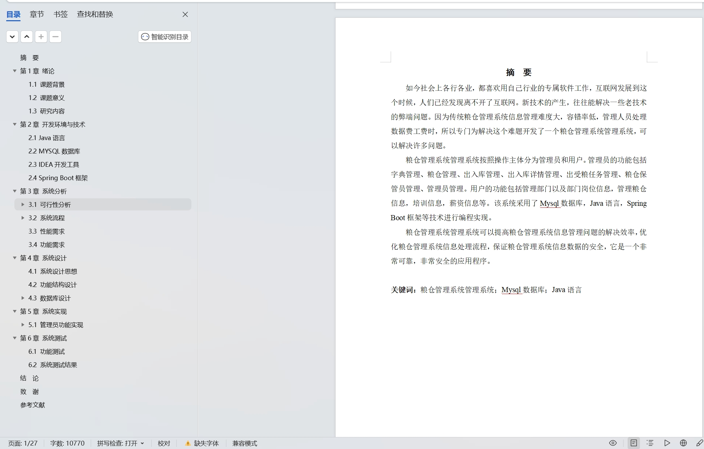
### 1、用户：

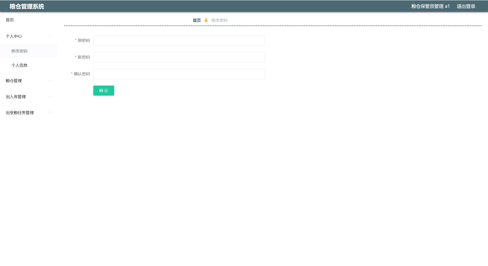
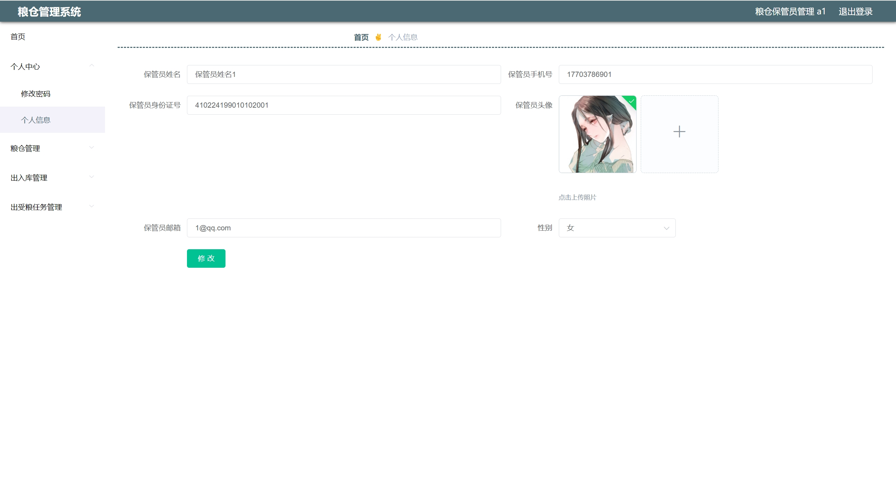
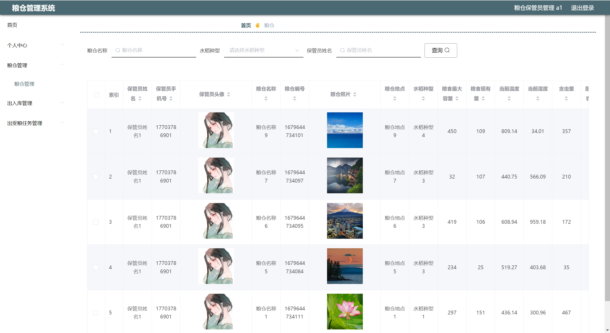
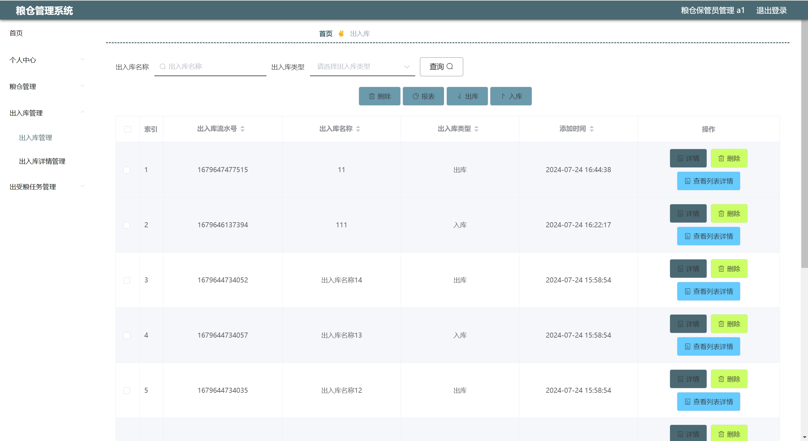
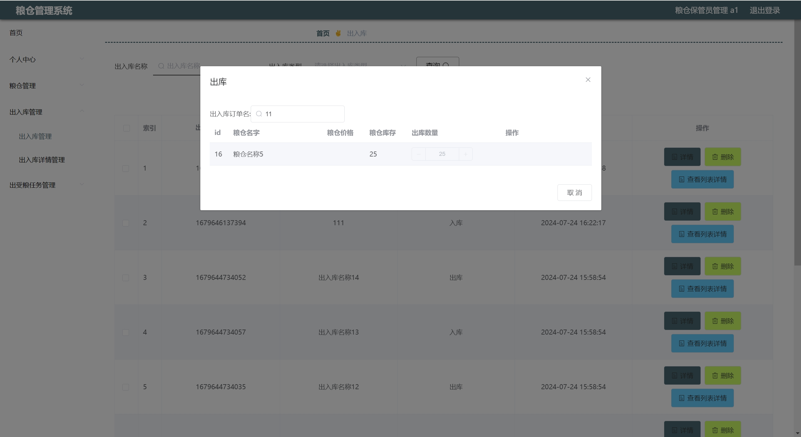
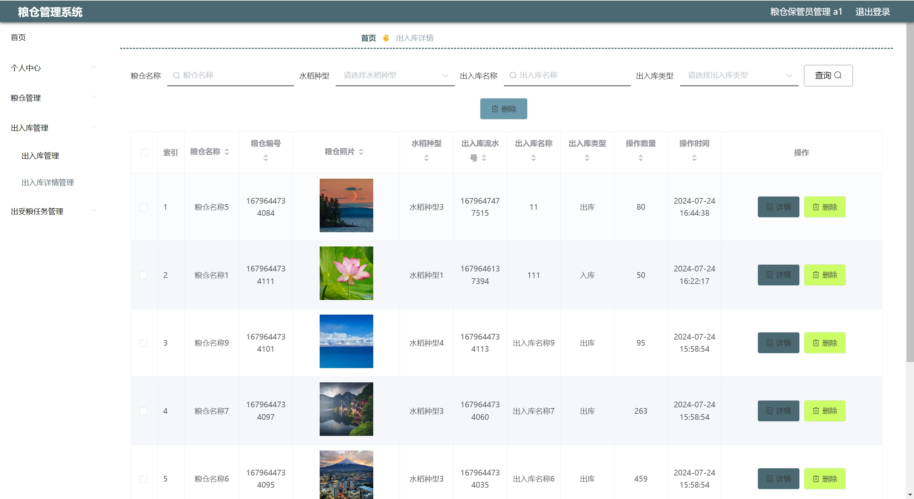
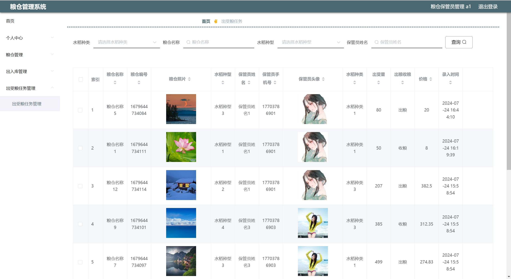

### 2、管理员：
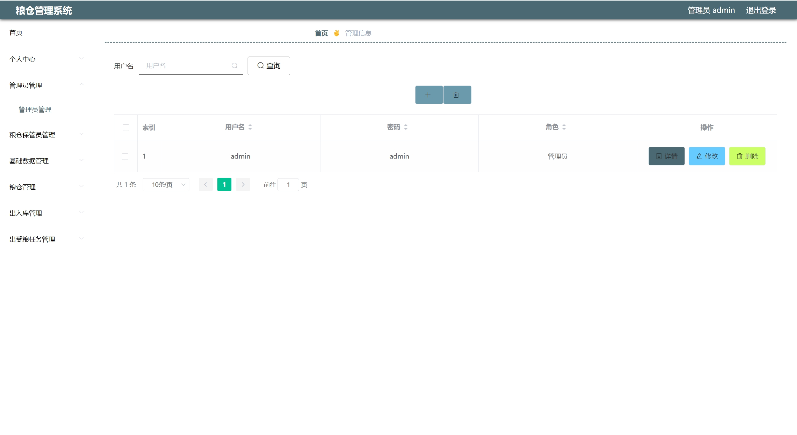
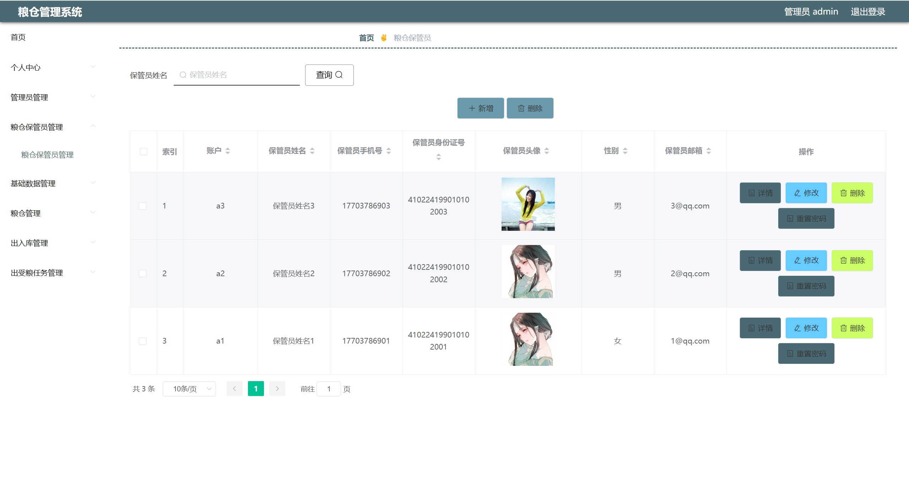
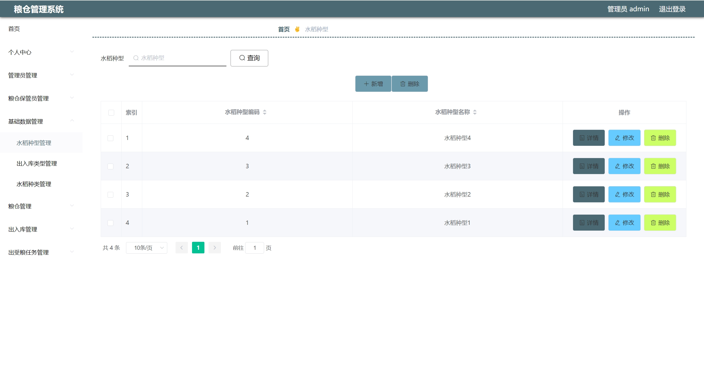
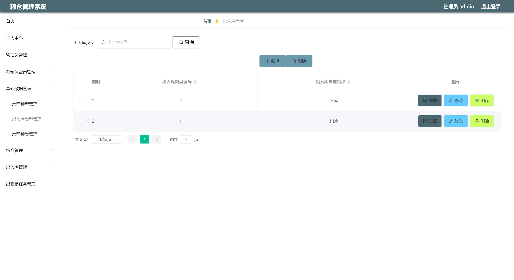
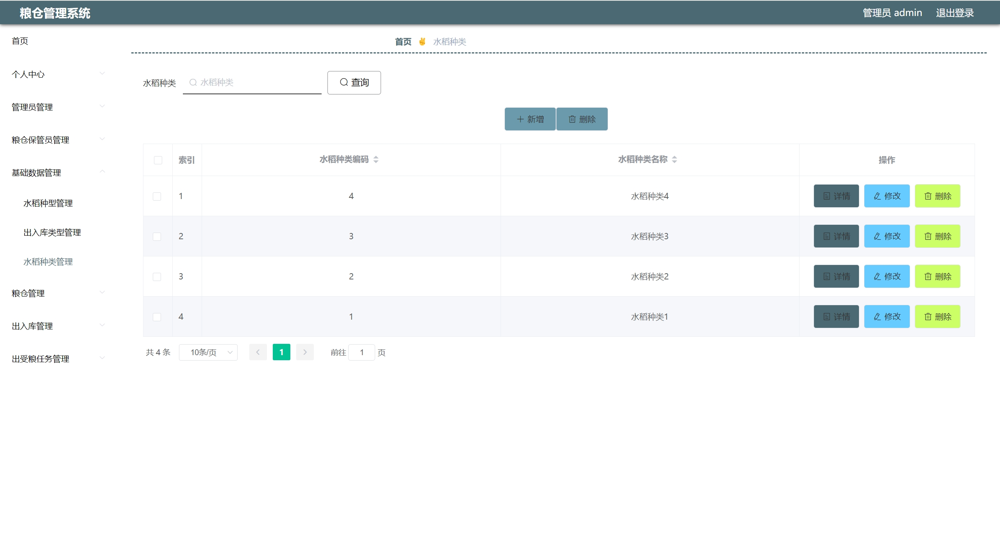

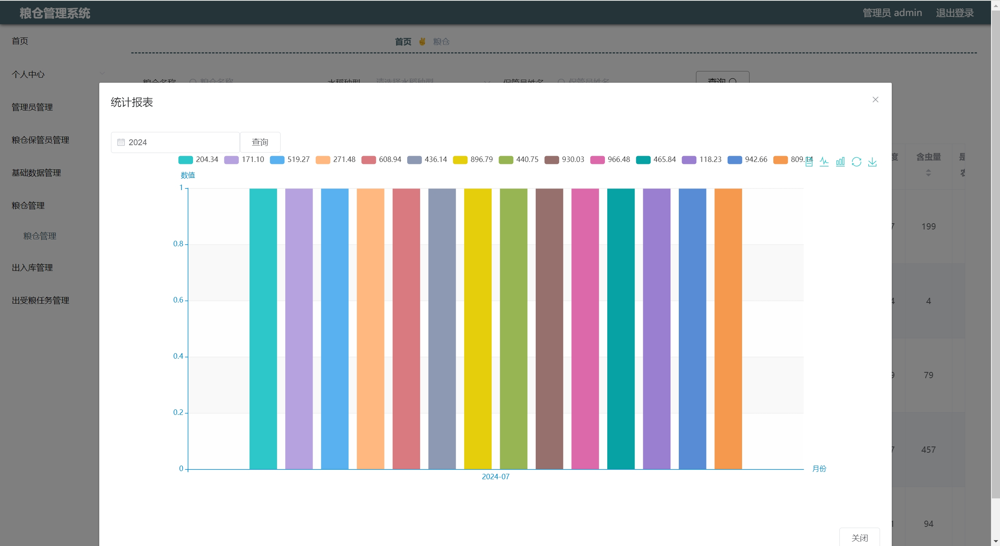

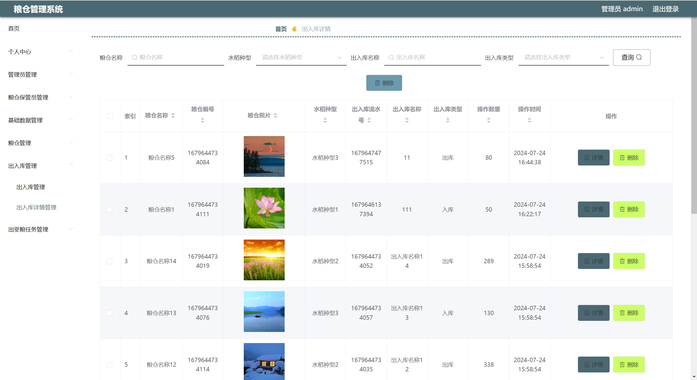
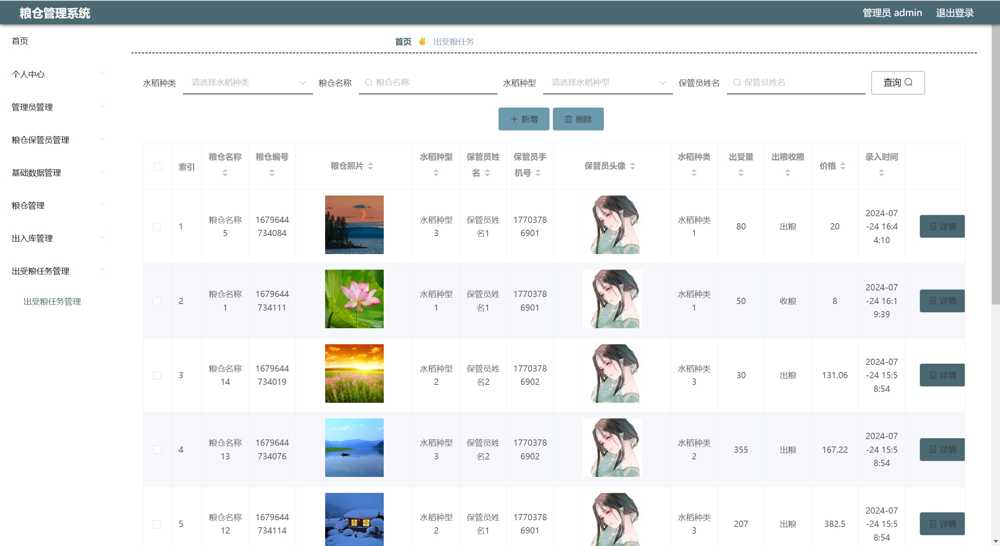

## 五、浏览地址

后台地址：http://localhost:8081

仓库保管员账号密码：a1/123456

管理员账户密码：admin/admin

## 六、部署教程
1. 使用Navicat或者其它工具，在mysql中创建对应名称的数据库，并执行项目的sql文件

2. 使用IDEA/Eclipse导入granarySystem项目，若为maven项目请选择maven，等待依赖下载完成
 
3. 修改application.yml里面的数据库配置,src/main/java/com/SpringbootApplication.java.java启动后端项目
 
4. vscode或idea打开src/main/resources/admin/admin目录

5. 在编译器中打开terminal，执行npm install 依赖下载完成后执行 npm run serve启动,执行成功后会显示访问后台地址
